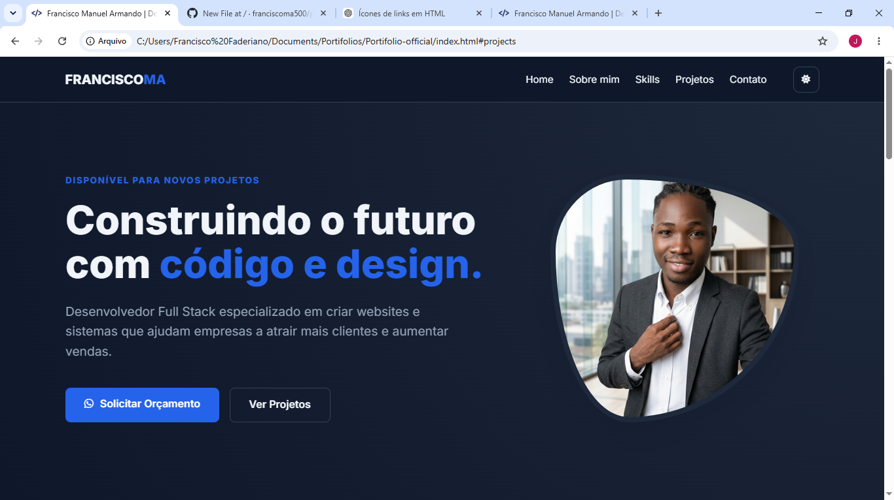
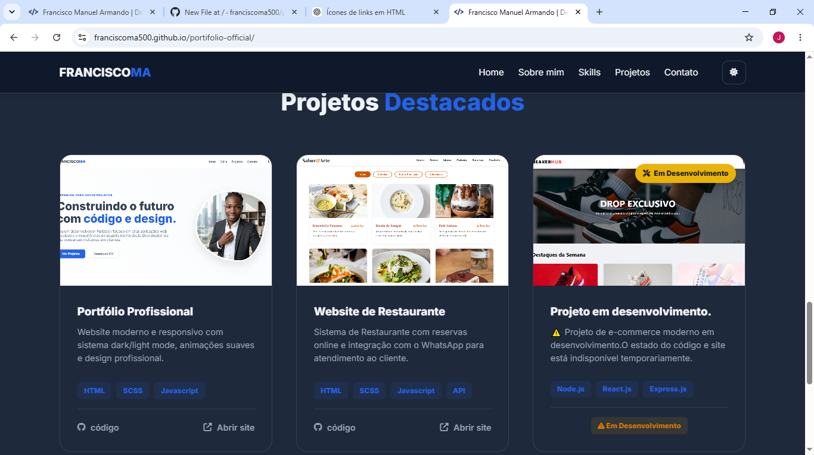
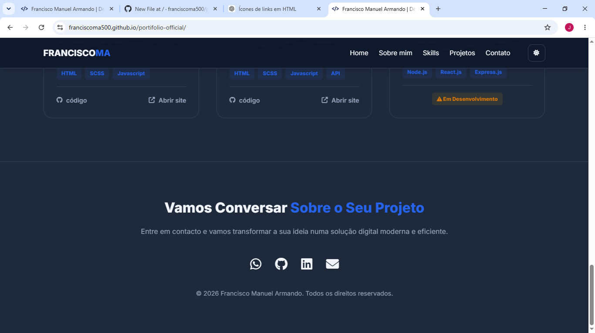

# 🌐 Portfólio Profissional

Um portfólio moderno e responsivo desenvolvido para apresentar projetos, competências e serviços de desenvolvimento web de forma profissional.

## 🚀 Visão Geral

Este projeto foi criado com o objetivo de demonstrar competências em desenvolvimento Front-End, design responsivo, organização de código e boas práticas de desenvolvimento web.

O website apresenta uma interface moderna, navegação intuitiva e uma experiência otimizada para diferentes dispositivos.

## ✨ Funcionalidades

* 📱 Design totalmente responsivo
* 🌙 Modo claro e escuro
* 🎨 Interface moderna e profissional
* ⚡ Performance otimizada
* 📂 Secção de projetos
* 👨‍💻 Apresentação de competências técnicas
* 📞 Canais de contacto
* 🔗 Integração com redes profissionais
* ♿ Estrutura focada em acessibilidade

## 🛠️ Tecnologias Utilizadas

### Front-End

* HTML5
* CSS3
* SCSS
* JavaScript

### Ferramentas

* Git
* GitHub
* VS Code

## 📸 Demonstração

## 🌍 Acesso ao Projeto

### Website

https://franciscoma500.github.io/portifolio-official/

### Repositório

Disponível neste repositório GitHub.

## 🎯 Objetivos do Projeto

* Demonstrar competências em desenvolvimento web moderno
* Apresentar projetos e experiências profissionais
* Disponibilizar um canal de contacto para potenciais clientes e recrutadores
* Aplicar boas práticas de performance e responsividade

## 📈 Melhorias Futuras

* Integração com CMS
* Blog técnico
* Internacionalização (PT/EN)
* Animações avançadas
* Novos estudos de caso (Case Studies)

## 📬 Contacto

📧 Email: [franciscomanuelarmando500@email.com](mailto:franciscomanuelarmando500@email.com)

🌐 Portfólio: https://franciscoma500.github.io/portifolio-official

💼 Disponível para projetos freelance e oportunidades profissionais.

---

⭐ Se gostou deste projeto, considere deixar uma estrela no repositório.
